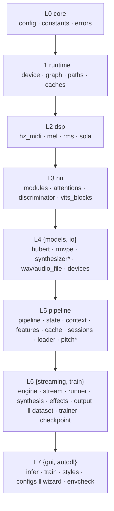

# 目标架构方案（第三轮重写 · 阶段二）

> 基线：`master@d9f6a3b`（工作区干净，132 个已跟踪文件 / 114 个 `.py` / 11,771 行）。
> 上游冻结件：`docs/rewrite-v3/功能基线清单.md`（248 主条目 + §10 19 + §11 18 + §12 5 + §13 105 无护栏）、`docs/rewrite-v3/现状问题清单.md`（P0=0 / P1=17 / P2=10 / D-1…D-6）。
> 方法：本方案**只读代码体检 + 结构设计**；不改项目代码，只写本文件。
> **范围**：`Retrieval-based-Voice-Conversion-WebUI/`（gitignore 参考副本）不在范围内，全文不涉。

---

## 0. 设计总纲与硬约束（不可协商）

| # | 硬约束 | 本方案的落实方式 |
|---|---|---|
| C1 | **对外可观测行为逐字逐值不变**（唯一例外 = §12 模型信息首行） | 所有改动限定在「内部形态」；§3(48)+§4(14)+§10(19) = **81 条逐字逐值原样搬运，零优化** |
| C2 | **不新增任何第三方依赖** | `requirements.txt` 逐字不变；不引入 `attrs`/`pydantic`/`dataclasses-json` 等 |
| C3 | **删除全部旧接口 / 旧数据 / 旧配置 / 兼容层** | 死代码、死分支、`hasattr` 死探测、过期 docstring、`ConfigError`（无人抛/捕）一律清除（清单见 §4 类别 B）；**唯一豁免 = `save_state.json` 的 `gui`/`train` 结构** |
| C4 | **禁用泛化命名** `data`/`info`/`manager`/`util`/`helper`/`common(s)` | 命名规则 §3 + 现名→新名映射表；`name`/`archive` 字样只留给 zip 归档名 |
| C5 | **单一职责（SRP）** | 见 §4 类别 C；>400 行文件仅 `nn/modules.py`（上游拷贝，判定保持，见 D-13） |
| C6 | **显式优于隐式** | 消除全局单例副作用、`hasattr` 探测、位置化魔法下标、哨兵参数（§4 类别 C） |
| C7 | **错误显式化、不吞异常** | `except: pass` / 裸 `except Exception: return None` 全部改为精确捕获或 `logger.warning`（§4 类别 C-9） |
| C8 | **8 层单向无环依赖** | `core(0)→runtime(1)→dsp(2)→nn(3)→{models,io}(4)→pipeline(5)→{streaming,train}(6)→{gui,autodl}(7)`；本方案**不新增层、不跨层引用**（§1 图 + §7 校验） |
| C9 | **本轮零护栏**（§13） | 本方案不建测试 / 不建 guard / 不写 diff harness；以「§7 可执行纪律 + 用户真机验收」兜底 |

> 阶段三落地原则：**危险区只做搬运，安全区才做提纯**。数值链路（`dsp/` / `pipeline/` / `streaming/` / `nn/` / `models/`）默认 `=保持`；结构提纯集中在 `gui/` / `autodl/` / 各层「契约与命名」这些**不触碰数值路径**的位置。

---

## ① 目标分层架构图（含 diff 标记）

标记图例：`=保持`（不动）·`⇄改名`（符号改名，文件不移动）·`⇄修复`（内部形态重写，对外行为不变）·`⇄清理`（删死物/过期注释）·`★新增`·`✗删除`。

### 1.1 目标目录树（ASCII）

```
RVC/
├─ app.py                          ⇄修复  推理 GUI 入口（副作用收敛进 main()）
├─ autodl_train.py                 =保持  云训练入口
├─ start-infer.bat / start-train.bat  =保持
├─ requirements.txt                =保持   ★禁止新增依赖★
├─ README.md                       ⇄清理  结构/能力描述如实化（P1-1/P2-5）
│
├─ rvc/                            ── 引擎（库层，禁 import gui/autodl）
│  ├─ core/            [L0 最内]
│  │   ├─ config.py                =保持  TrainConfig / InferenceParams 等 dataclass
│  │   ├─ constants.py             =保持  全局常量（RMVPE_THRESHOLD_* 等）
│  │   └─ errors.py                ⇄清理  领域异常；✗删除 ConfigError（全仓无人抛/捕）
│  ├─ runtime/         [L1]
│  │   ├─ device.py                ⇄改名  Config ✗ → RuntimeDeviceConfig ★（消歧 + 去 Manager 化）
│  │   ├─ graph.py                 ⇄修复  CUDA Graph + RuntimeOptions；_active_options 全局→显式注入
│  │   ├─ paths.py                 ⇄清理  ✗删除 FFPROBE_EXE（死常量）
│  │   ├─ caches.py                =保持  运行期缓存工具
│  │   └─ __init__.py              ⇄改名  惰性导出 __all__ / __getattr__ 同步改名
│  ├─ dsp/             [L2]        =保持  hz_midi / mel / rms / sola（数值路径，整层冻结）
│  ├─ nn/              [L3]
│  │   ├─ modules.py               =保持  上游逐字拷贝；仅局部变量 data→语义名（数值零变，D-13）
│  │   ├─ attentions.py / discriminator.py / vits_blocks.py  =保持
│  ├─ models/          [L4a]
│  │   ├─ hubert.py                ⇄修复  手工换流 → 统一 _suppress_third_party_output contextmanager
│  │   ├─ rmvpe/model.py           ⇄清理  weights_only=False 补「来源可信」安全注释（P1-12）
│  │   ├─ rmvpe/{blocks,transforms,constants,__init__}.py  =保持
│  │   ├─ synthesizer_{model,encoder,decoder,flow}.py      =保持
│  │   └─ __init__.py              ⇄改名  惰性导出同步改名（若含）
│  ├─ io/              [L4b]
│  │   ├─ wav_file.py              ⇄改名  data→samples/pcm_*；read_*_info→read_*_metadata
│  │   ├─ audio_file.py            =保持  （同步引用 read_audio_metadata）
│  │   ├─ devices.py               ⇄改名  _rescan_portaudio_devices → 公开 rescan_audio_devices（唯一故障点）
│  │   └─ __init__.py              =保持
│  ├─ pipeline/        [L5]
│  │   ├─ pipeline.py              =保持  ★实时 5 阶段编排 + VoiceEngine，数值路径冻结★
│  │   ├─ state.py                 =保持  EngineState（跨块）
│  │   ├─ context.py               ⇄修复  InferenceContext.reset() 支持 default_factory（P1-14）
│  │   ├─ features.py              =保持  ★特征提取 / upsample 对齐，数值路径冻结★
│  │   ├─ synthesis.py             =保持
│  │   ├─ cache.py                 ⇄修复  default_inference_cache 全局 → 实例归属（P1-6）
│  │   ├─ sessions.py              ⇄修复  去 hasattr(bundle,"synthesizer") 探测 → 显式契约（P1-10）
│  │   ├─ loader.py                ⇄清理  weights_only=False 补安全注释（P1-12）
│  │   └─ pitch/
│  │       ├─ extractor.py         =保持  报错文案属对外可见字符串 → 越权项已撤下（附录 H）
│  │       ├─ postprocess.py       ⇄改名  魔法数 → 具名常量（数值零变，P2-6）
│  │       └─ tracker.py           ⇄修复  ★docstring「最后」→「前 p_len 帧」（代码不动，P1-2/D-1）★
│  ├─ streaming/       [L6a]
│  │   ├─ engine.py                ⇄改名  _stream_mgr → _streams；VoiceEngine 对外口径不变
│  │   ├─ stream.py                ⇄改名  AudioStreamManager → AudioStreams；in/out_info→*_record
│  │   ├─ runner.py                ⇄清理  ✗删除 state.function 恒"vc" 死分支（P1-15/D-4）
│  │   ├─ synthesis.py             ⇄改名  魔法数（>=64 整表清空）→ 具名常量（数值零变）
│  │   ├─ effects.py               ⇄清理  ✗删过期 docstring（清辅音保护/pitchf_cache）
│  │   └─ output.py                ⇄清理  queue.Empty 精确捕获；✗删死成员 AudioProcessor.sr
│  └─ train/           [L6b]
│      ├─ dataset.py               ⇄修复  位置化 6/9 元组 → 具名 batch dataclass（P1-10）；data_config→mel_config
│      ├─ trainer.py               ⇄修复  属性在 __init__ 声明为 None（P1-16）；data_cfg→mel_config
│      ├─ checkpoint.py            ⇄修复  ★§12 inspect_model 首行 info + zip 原名独立行；change_info→change_model_info★
│      ├─ mel_processing.py        ⇄清理  ✗删除 MAX_WAV_VALUE（死常量，P2-2）
│      ├─ preprocess.py / extract_feature.py / extract_f0.py / losses.py  =保持
│
├─ gui/                            ── 视图层（L7，禁顶层 import rvc.*）
│  ├─ configs/config.py            ⇄修复  save_config(data)→state；save_state.json 键映射显式（结构不变）
│  ├─ styles/{colors,components,layout,theme}.py  =保持
│  ├─ infer/
│  │   ├─ view/
│  │   │   ├─ window.py            ⇄修复  ✗删死 hasattr 探测；offline_manager→offline_conversion
│  │   │   ├─ lifecycle.py         ⇄修复  ✗删死探测；gui_data→saved_params；宿主契约外提
│  │   │   ├─ contracts.py         ★新增  显式 View 宿主契约（Protocol），替代 mixin 隐式属性
│  │   │   ├─ widgets.py           ⇄修复  _update_label 提为 DoubleSlider 正式方法（P1-5）
│  │   │   ├─ tray.py              ⇄改名  TrayManager → SystemTray；经 controller 公开接口触发
│  │   │   └─ tabs/{audio_driver,experimental,global_params,offline}_tab.py
│  │   │                            ⇄修复  global_params 显式控件属性；余 =保持
│  │   ├─ controller/
│  │   │   ├─ engine_controller.py ⇄修复  ✗移除 _load_thread 空转（P1-17）
│  │   │   ├─ offline_controller.py⇄改名  OfflineManager → OfflineConversion
│  │   │   ├─ device_controller.py ⇄修复  复用 rescan_audio_devices（唯一故障点，P1-11）
│  │   │   └─ telemetry.py         =保持
│  │   └─ state/bindings.py        ⇄修复  ✗删 hasattr 探测；params_from_dict(data)→state
│  └─ train/
│      ├─ view/
│      │   ├─ window.py            ⇄修复  on_loss(data)→loss_report；save_every 内部单一来源
│      │   ├─ widgets.py           =保持
│      │   └─ tabs/
│      │       ├─ settings_tab.py  ⇄清理  _build_data_group→_build_dataset_group；✗删 _state_defaults 死赋值
│      │       ├─ tools_inspect.py ⇄修复  ★§12.3 解析目标「首行」→「zip 原名行」★
│      │       ├─ tools_fixinfo.py ⇄改名  _run_fixinfo→apply_model_info；fix_info→model_info
│      │       ├─ tools_merge.py / tools_tab.py / train_tab.py  =保持
│      ├─ controller/
│      │   ├─ train_controller.py  ⇄修复  change_info→change_model_info；键名单一来源
│      │   └─ workers.py           ⇄修复  options dict → 显式 TrainRequest；Config→RuntimeDeviceConfig
│      └─ state/train_state.py     ⇄修复  内部键单一来源（★默认值 20/200 各自不变★）
│
├─ autodl/                         ── 云训练向导（L7，唯一允许 Linux 运行）
│  ├─ __init__.py                  ⇄修复  import 期副作用（sys.path/改流/DATA_ROOT）收敛到 main()（P1-7）
│  ├─ envcheck.py                  ⇄修复  素材/ffmpeg 探测失败显式化（P1-9）；RVC_FFMPEG 三级定位保持
│  ├─ wizard.py / steps.py / prompts.py / logger.py / __main__.py  =保持
│
└─ assets/
   ├─ configs/{40k,48k}train_config.json  =保持（对外配置格式）
   ├─ rmvpe/rmvpe_inputs.pth              =保持（D-6：文件保留）
   ├─ ffmpeg/ · hubert/ · models/ · pretrained/ · resources/  =保持
```

### 1.2 8 层依赖图（Mermaid · 单向无环）



> 本方案**不新增任何跨层边**；`gui/infer/view/contracts.py`（新增）位于 L7 内部，只被 L7 引用。

---

## ② 模块 / 文件清单（职责一句话 · delta 标记）

> 全量 **130** 个已跟踪文件 = 表内明细 **97** + 未列 **33**（`__init__`/资产/批处理，统一 `=保持`）；另 **★新增 1**（`gui/infer/view/contracts.py`，不计入 130）。delta 标记：`=保持` / `⇄改名` / `⇄修复` / `⇄清理` / `★新增` / `✗删除`。
> 核对：`97 明细 + 33 未列 = 130 基线`；`保持(47 明细+33 未列=80) + 修改(50) + 新增(1) = 131`。
> 「职责」为设计与维护用的**目标一句话描述**（不是对外文档）。

### 2.1 rvc/ 引擎层

| 路径 | 职责（一句话） | delta |
|---|---|---|
| `rvc/core/config.py` | `TrainConfig` / `InferenceParams` 等配置 dataclass 定义 | =保持 |
| `rvc/core/constants.py` | 全局常量（阈值、采样率等） | =保持 |
| `rvc/core/errors.py` | 领域异常类型 | ⇄清理（✗删 `ConfigError`） |
| `rvc/runtime/device.py` | 进程级设备配置与 GPU 可用性检查 | ⇄改名（`Config`→`RuntimeDeviceConfig`） |
| `rvc/runtime/graph.py` | CUDA Graph 捕获/回放 + `RuntimeOptions` 显式开关 | ⇄修复（去 `_active_options` 全局） |
| `rvc/runtime/paths.py` | 资产/模型/日志路径解析 | ⇄清理（✗删 `FFPROBE_EXE`） |
| `rvc/runtime/caches.py` | 运行期缓存工具函数 | =保持 |
| `rvc/runtime/__init__.py` | runtime 包惰性导出 | ⇄改名（`__all__`/`__getattr__` 同步） |
| `rvc/dsp/hz_midi.py` | Hz ↔ MIDI 音高换算 | =保持 |
| `rvc/dsp/mel.py` | Mel 滤波器组构造 | =保持 |
| `rvc/dsp/rms.py` | RMS 计算 | =保持 |
| `rvc/dsp/sola.py` | SOLA 音频拼接 | =保持 |
| `rvc/dsp/__init__.py` | dsp 包标记 | =保持 |
| `rvc/nn/modules.py` | VITS/流式神经网络基元（上游逐字拷贝） | =保持（仅局部改名） |
| `rvc/nn/attentions.py` | 注意力机制基元 | =保持 |
| `rvc/nn/discriminator.py` | 训练用判别器 | =保持 |
| `rvc/nn/vits_blocks.py` | VITS 残差块 | =保持 |
| `rvc/nn/__init__.py` | nn 包标记 | =保持 |
| `rvc/models/hubert.py` | HuBERT 特征提取封装 | ⇄修复（换流→contextmanager） |
| `rvc/models/rmvpe/model.py` | RMVPE F0 模型 | ⇄清理（补安全注释） |
| `rvc/models/rmvpe/blocks.py` | RMVPE 网络块 | =保持 |
| `rvc/models/rmvpe/transforms.py` | RMVPE 输入变换 | =保持 |
| `rvc/models/rmvpe/constants.py` | RMVPE 常量 | =保持 |
| `rvc/models/rmvpe/__init__.py` | RMVPE 导出 | =保持 |
| `rvc/models/synthesizer_model.py` | 合成器总装 | =保持 |
| `rvc/models/synthesizer_encoder.py` | 合成器编码器 | =保持 |
| `rvc/models/synthesizer_decoder.py` | 合成器解码器 | =保持 |
| `rvc/models/synthesizer_flow.py` | 合成器流模型 | =保持 |
| `rvc/models/__init__.py` | models 包惰性导出（仅 `load_hubert`） | =保持（实测无 `Config` 导出，无需同步） |
| `rvc/io/wav_file.py` | WAV 读写 + 音频元数据读取 | ⇄改名（`data*`→`samples`/`pcm_*`，`read_*_info`→`read_*_metadata`） |
| `rvc/io/audio_file.py` | 音频路径→张量读取 | =保持（同步新名引用） |
| `rvc/io/devices.py` | PortAudio 设备枚举与重扫（唯一故障点） | ⇄改名（`_rescan_portaudio_devices`→`rescan_audio_devices`） |
| `rvc/io/__init__.py` | io 包标记 | =保持 |
| `rvc/pipeline/pipeline.py` | 实时推理 5 阶段编排 + `VoiceEngine` 组装 | ⇄修复（C-3 波及：`default_inference_cache` import/回退，:23/:59） |
| `rvc/pipeline/state.py` | `EngineState`（跨块状态） | =保持 |
| `rvc/pipeline/context.py` | `InferenceContext`（逐块状态 + `reset()`） | ⇄修复（`reset` 支持 `default_factory`） |
| `rvc/pipeline/features.py` | 特征提取与 upsample 对齐 | =保持 |
| `rvc/pipeline/synthesis.py` | 合成调用封装（含 `apply_formant_resample`） | ⇄改名（A-2 魔法数 `>= 64`@:76→具名常量） |
| `rvc/pipeline/cache.py` | 推理缓存 | ⇄修复（`default_inference_cache` 全局→实例） |
| `rvc/pipeline/sessions.py` | `ModelSessions` 加载会话管理 | ⇄修复（去 `hasattr` 探测→显式契约） |
| `rvc/pipeline/loader.py` | 合成器/特征模型加载 | ⇄清理（补安全注释） |
| `rvc/pipeline/pitch/extractor.py` | RMVPE F0 提取 | =保持（原拟改报错文案=越权，已撤下，见附录 H） |
| `rvc/pipeline/pitch/postprocess.py` | F0 后处理与音域映射 | ⇄改名（魔法数→具名常量） |
| `rvc/pipeline/pitch/tracker.py` | F0 ↔ 特征帧对齐（取前 `p_len` 帧） | ⇄修复（docstring 改「前 p_len 帧」） |
| `rvc/pipeline/pitch/__init__.py` | pitch 包标记 | =保持 |
| `rvc/streaming/engine.py` | 对外 `VoiceEngine` + 流管理 | ⇄改名（`_stream_mgr`→`_streams`） |
| `rvc/streaming/stream.py` | 音频流生命周期（`AudioStreams`） | ⇄改名（类名 + 局部 `*_record`/`audio_clock`） |
| `rvc/streaming/runner.py` | 实时 runner（预处理/推理/后处理调度） | ⇄清理（✗删 `state.function` 死分支） |
| `rvc/streaming/effects.py` | 输出后处理（RMS/SOLA/限幅）+ `AudioProcessor` | ⇄清理（✗删过期 docstring；✗删 `AudioProcessor.sr`） |
| `rvc/streaming/output.py` | 输出队列与副输出 | ⇄清理（`queue.Empty` 精确捕获） |
| `rvc/train/dataset.py` | 训练数据集与 collate | ⇄修复（具名 batch dataclass；`data_config`→`mel_config`） |
| `rvc/train/trainer.py` | 训练主循环 | ⇄修复（属性 `__init__` 声明；`data_cfg`→`mel_config`） |
| `rvc/train/checkpoint.py` | 检查点保存/加载/导出/合并/检视 | ⇄修复（§12 首行 info；`change_info`→`change_model_info`；安全注释） |
| `rvc/train/mel_processing.py` | Mel 谱处理 | ⇄清理（✗删 `MAX_WAV_VALUE`） |
| `rvc/train/preprocess.py` | 训练数据预处理 | =保持 |
| `rvc/train/extract_feature.py` | 训练特征抽取 | =保持 |
| `rvc/train/extract_f0.py` | 训练 F0 抽取 | =保持 |
| `rvc/train/losses.py` | 损失函数 | =保持 |

### 2.2 gui/ 视图层

| 路径 | 职责（一句话） | delta |
|---|---|---|
| `gui/configs/config.py` | `save_state.json` 读写（键映射显式，结构不变） | ⇄修复 |
| `gui/styles/colors.py` | 颜色常量 | =保持 |
| `gui/styles/components.py` | 组件级 QSS | =保持 |
| `gui/styles/layout.py` | 布局常量 | =保持 |
| `gui/styles/theme.py` | 主题装配 | =保持 |
| `gui/infer/view/window.py` | 推理主窗口装配 | ⇄修复（✗删死 `hasattr` 探测；字段改名） |
| `gui/infer/view/lifecycle.py` | 窗口生命周期逻辑 | ⇄修复（✗删死探测；`gui_data`→`saved_params`） |
| `gui/infer/view/contracts.py` | 显式 View 宿主契约（Protocol） | **★新增** |
| `gui/infer/view/widgets.py` | 自定义控件（含 `LoadThread`） | ⇄修复（`_update_label` 提为正式方法） |
| `gui/infer/view/tray.py` | 系统托盘（`SystemTray`） | ⇄改名 |
| `gui/infer/view/tabs/audio_driver_tab.py` | 音频驱动页签 | =保持 |
| `gui/infer/view/tabs/experimental_tab.py` | 音色调节页签 | =保持 |
| `gui/infer/view/tabs/global_params_tab.py` | 全局参数页签 | ⇄修复（显式控件属性） |
| `gui/infer/view/tabs/offline_tab.py` | 离线转换页签 | =保持 |
| `gui/infer/controller/engine_controller.py` | 引擎加载控制 | ⇄修复（✗移除 `_load_thread` 空转） |
| `gui/infer/controller/offline_controller.py` | 离线转换控制（`OfflineConversion`） | ⇄改名 |
| `gui/infer/controller/device_controller.py` | 设备目录与刷新（`DeviceCatalog`） | ⇄修复（复用 `rescan_audio_devices`） |
| `gui/infer/controller/telemetry.py` | 运行遥测 | =保持 |
| `gui/infer/state/bindings.py` | `BINDINGS` 表与参数读写 | ⇄修复（✗删 `hasattr`；`params_from_dict(data)`→`state`） |
| `gui/train/view/window.py` | 训练主窗口装配 | ⇄修复（`on_loss(data)`→`loss_report`） |
| `gui/train/view/widgets.py` | 训练控件（含 `ToolThread`） | ⇄修改（B4 定案：`ToolThread`→`ToolRunner`） |
| `gui/train/view/tabs/settings_tab.py` | 训练设置页签 | ⇄清理（`_build_dataset_group`；✗删 `_state_defaults`） |
| `gui/train/view/tabs/tools_inspect.py` | 查看模型信息 / 改 zip 原名 | ⇄修复（§12.3 解析目标改行） |
| `gui/train/view/tabs/tools_fixinfo.py` | 修正模型信息（info） | ⇄改名（`_run_fixinfo`→`apply_model_info`） |
| `gui/train/view/tabs/tools_merge.py` | 模型合并工具 | ⇄修改（B4 定案：改用 `win.tool_runner`） |
| `gui/train/view/tabs/tools_tab.py` | 工具页签装配 | =保持 |
| `gui/train/view/tabs/train_tab.py` | 训练参数页签 | =保持 |
| `gui/train/controller/train_controller.py` | 训练编排 | ⇄修复（`change_model_info`；键名单一来源） |
| `gui/train/controller/workers.py` | 训练/工具 worker | ⇄修复（`TrainRequest` 显式化；`RuntimeDeviceConfig`） |
| `gui/train/state/train_state.py` | 训练 GUI 状态 | ⇄修复（内部键单一来源；默认值不变） |

### 2.3 autodl/ + 顶层

| 路径 | 职责（一句话） | delta |
|---|---|---|
| `autodl/__init__.py` | 向导包入口（环境解析、流配置） | ⇄修复（副作用收敛到 `main()`） |
| `autodl/envcheck.py` | 环境/素材/ffmpeg 探测 | ⇄修复（失败显式化；三级定位保持） |
| `autodl/wizard.py` | 向导主流程 | =保持 |
| `autodl/steps.py` | 向导步骤实现 | ⇄改名（A-1：`on_loss(info)`→`on_loss(loss_report)`；B1 已改，原漏列） |
| `autodl/prompts.py` | 交互提示 | =保持 |
| `autodl/logger.py` | 双写日志 | =保持 |
| `autodl/__main__.py` | 向导 CLI 入口 | =保持 |
| `app.py` | 推理 GUI 入口 | ⇄修复（副作用收敛到 `main()`） |
| `autodl_train.py` | 云训练入口 | =保持 |
| `README.md` | 项目说明 | ⇄清理（结构/能力如实化） |
| `requirements.txt` / `start-*.bat` / `.gitignore` / `assets/**` | 依赖·启动脚本·忽略·资产 | =保持 |
| `tests/`（已删） | — | ✗删除（**本轮不恢复**，§13） |

### 2.4 delta 汇总

| 类别 | 数量 | 说明 |
|---|---|---|
| ★新增 | **1** | `gui/infer/view/contracts.py` |
| ⇄改名（文件级） | **0** | 本方案默认**不移动文件**；全部改名为文件内符号改名 |
| ⇄删除（文件级） | **0** | 无文件删除；死代码为**文件内**切除 |
| ⇄合并 | **0** | 无文件合并 |
| ⇄修复 / ⇄清理（文件级修改） | **50** | 见上表 delta 列 + 附录「50 项修改清单」 |
| =保持 | **80** | 含全部 `dsp/`、`nn/` 数值路径与资产，以及撤下 D-4 后的 `extractor.py` |

> **Δ 合计**：新增 1 文件、修改 50 文件、保持 80 文件；**净文件数 130 → 131**（+1）。
> ⚠ 本 delta 为**方案预期值**（派生自三条推导链的机械对账，见附录）——它是「**异常指示器**」，**不是通过标准**。S4 以 `git diff --stat` 实测为准；实际 ≠ 50 时**逐条解释差异**（多改/漏改/降级为零改动）。计数口径：基线 130 = 保持 81 / 修改 49（+1 新增另计）；**D-1 定案**使 `gui/train/view/widgets.py`、`tools_merge.py` 由保持转修改（**+2 改**）；**D-4 撤回**使 `rvc/pipeline/pitch/extractor.py` 由修改转保持（**−1 改**）→ 汇总 **保持 80 / 修改 50**（见附录 H）。

---

## ③ 命名规范（正式规则）+ 现名 → 新名映射

### 3.1 正式命名规则（R1–R8，项目级强制）

| 规则 | 内容 |
|---|---|
| **R1** | **泛化词禁令**：标识符（文件/类/函数/变量/参数）禁 `data` / `info` / `manager` / `util` / `helper` / `common(s)`。第三方（`torch.nn.utils`、`transformers.utils`、`logging.exc_info`）与专有常量（`DATA_ROOT`）除外。 |
| **R2** | **类名 = 名词短语**，体现职责边界（例：`RuntimeDeviceConfig`、`AudioStreams`、`OfflineConversion`、`SystemTray`）。 |
| **R3** | **函数名 = 动词短语**（例：`rescan_audio_devices`、`apply_model_info`、`change_model_info`、`read_wav_metadata`）。 |
| **R4** | **变量/参数名 = 语义名词**（例：`samples`、`pcm_chunk`、`input_record`、`audio_clock`、`mel_config`、`state`、`loss_report`）。 |
| **R5** | **保留字硬约束**：`name` / `archive` / `*_name_edit` / `*_archive*` **只指 zip 归档名**；info 一侧一律叫「信息」（`model_info`）。此约束**优先于任意具体取名**（与 PM §12.4 逐字一致）。 |
| **R6** | **持久化键不动**：`save_state.json` 的 `gui`/`train` 结构与既有键名（如 `save_every`）**保持不变**；内部单一来源靠**唯一序列化边界**显式映射，不靠改持久化键。 |
| **R7** | **魔法数具名化**：裸字面量阈值 → 大写具名常量 + 注释给出推导（数值不变，P2-6）。 |
| **R8** | **缩写白名单**：`sr` / `f0` / `rms` / `sola` / `pcm` / `nn` / `dsp` / `io` / `hz` / `midi` 允许作为标识符组成部分。 |

### 3.2 现名 → 新名映射表（落地用；与本项目《现状问题清单》附录 A 同源）

| 位置（文件:行） | 现名 | 新名 | 触发问题 |
|---|---|---|---|
| `rvc/runtime/device.py:12` | `Config` | `RuntimeDeviceConfig` | P2-1（并消与 `rvc.core.config` 撞名） |
| `rvc/runtime/__init__.py:8,12-14` | `__all__`/`__getattr__` 的 `Config` | `RuntimeDeviceConfig` | P2-1 连通 |
| `rvc/streaming/stream.py:24` | `AudioStreamManager` | `AudioStreams` | P2-1 |
| `rvc/streaming/engine.py:43` | `_stream_mgr` | `_streams` | P2-1 |
| `gui/infer/controller/offline_controller.py:21` | `OfflineManager` | `OfflineConversion` | P2-1 |
| `gui/infer/view/window.py:74` | `offline_manager` | `offline_conversion` | P2-1 |
| `gui/infer/view/tray.py:49` | `TrayManager` | `SystemTray` | P2-1 |
| `gui/train/view/tabs/settings_tab.py:19` | `_build_data_group` | `_build_dataset_group` | P2-1 |
| `rvc/train/dataset.py:23,33` | `data_config` | `mel_config` | P2-1 |
| `rvc/train/trainer.py:54` | `data_cfg` | `mel_config` | P2-1 |
| `rvc/train/checkpoint.py:236` | 局部 `data`（来自 `config["data"]`） | `mel_config`（**键名 `data` 保留**） | P2-1 + R6 |
| `rvc/io/wav_file.py:20` | 参数 `data` | `samples` | P2-1 |
| `rvc/io/wav_file.py:55,69` | `data_size`,`data_chunk` | `pcm_size`,`pcm_chunk` | P2-1 |
| `rvc/io/wav_file.py:75,125,141` | `read_wav_info`,`read_audio_info`,`info` | `read_wav_metadata`,`read_audio_metadata`,`metadata` | P2-1 |
| `rvc/streaming/stream.py:52,53,75` | `in_info`,`out_info`,`out2_info` | `input_record`,`output_record`,`secondary_record` | P2-1 |
| `rvc/streaming/stream.py:133,159` | `time_info` | `audio_clock` | P2-1 |
| `rvc/train/checkpoint.py:224` | `change_info(…, info)` | `change_model_info(…, model_info)` | P2-4 + §12.4 |
| `rvc/train/checkpoint.py:178` | `info_val` | `model_info` | P2-1 |
| `gui/train/view/tabs/tools_fixinfo.py:29,42,44,56` | `fix_info`,`_run_fixinfo`,`info`,`change_info` | `model_info`,`apply_model_info`,`model_info`,`change_model_info` | P2-4 + §12.4 |
| `gui/train/view/tabs/tools_inspect.py` | 「真名」文案 + `rename_edit` | 「zip 归档名」；`archive_name_edit` / `_run_rename_archive` | §12.4 消歧 |
| `gui/infer/view/window.py:108` | `_show_info` | ✗删除（死代码） | P2-2 |
| `gui/infer/view/lifecycle.py:30` | `gui_data` | `saved_params` | P2-1 |
| `gui/configs/config.py:33` | `save_config(data)` | `save_config(state)` | P2-1 |
| `gui/infer/state/bindings.py:65` | `params_from_dict(data)` | `params_from_dict(state)` | P2-1 |
| `gui/train/state/train_state.py:28` | `from_dict(data)` | `from_dict(state)` | P2-1 |
| `gui/train/view/window.py:199` | `on_loss(data)` | `on_loss(loss_report)` | P2-1 |
| `gui/train/view/tabs/settings_tab.py:31` | `_state_defaults` | ✗删除（死赋值） | P2-2 |
| `rvc/nn/modules.py:372` | ~~局部 `data`~~ | **✗撤销改名（B1 已撤销）**：此处为 PyTorch Tensor 属性 `self.post.weight.data.zero_()`，**不可改**；阶段一 P2-1 系误报 | P2-1（误报） |

> **反向红线**：本表**只含内部符号**。凡对外可见字符串（CLI 参数名、`save_state.json` 键、日志/报错文案的语义、`assets/*train_config.json` 键）**一律不改**（唯一例外见 §12）。

---

## ④ 数值中性的结构性改进（四类）

> **总声明**：以下每一类、每一条的「**数值 / 时序影响 = 零**」。凡无法证明零影响的改动，一律**不做**（并对齐 §13「逐字逐值原样搬运」）。

### 类别 A — 命名净化（纯符号改名，引用点同步）

| 条目 | 内容 | 数值/时序影响 |
|---|---|---|
| A-1 | 执行 §3.2 全部改名（`Config`/`AudioStreamManager`/`OfflineManager`/`TrayManager`/`data*`/`info*` …） | **零** |
| A-2 | 魔法数具名化：`rvc/pipeline/synthesis.py:76`（`>= 64` 整表清空，`apply_formant_resample`）、`rvc/pipeline/pitch/postprocess.py:79,97`（`> 128` 淘汰）、`rvc/core/config.py:38`（40ms 上限）、`rvc/streaming/engine.py:159`（预热 30 次）→ 大写常量，**字面值不变** | **零** |
| A-3 | 局部变量/参数语义化（各 controller/state 等）——**不含 `rvc/nn/modules.py`**（其 `data` 为 PyTorch Tensor 属性，B1 已撤销该改名） | **零** |

### 类别 B — 死代码 / 兼容层 / 死分支清除

| 条目 | 内容 | 数值/时序影响 |
|---|---|---|
| B-1 | ✗删 `MAX_WAV_VALUE`（`mel_processing.py`，上轮漏清，P2-2） | **零** |
| B-2 | ✗删 `FFPROBE_EXE` 常量（`runtime/paths.py:38`；文件 `ffprobe.exe` 保留，D-6） | **零** |
| B-3 | ✗删 `spectral_de_normalize_torch`、`manifest_matches`（零引用） | **零** |
| B-4 | ✗删 `class ConfigError`（`core/errors.py`；全仓无人抛/捕） | **零** |
| B-5 | ✗删 `_show_info`（`infer/view/window.py:108`）、`_state_defaults`（`settings_tab.py:31`，赋值后未用） | **零** |
| B-6 | ✗删 `AudioProcessor.sr`（`streaming/effects.py`，赋值后无读取） | **零** |
| B-7 | ✗删 `state.function` 恒 `"vc"` 死分支（`runner.py` / `engine.py`；D-4 裁定=清理） | **零**（不可达分支） |
| B-8 | ✗删 `engine_controller` 的 `_load_thread` 空转（恒 `None`；P1-17） | **零**（本就空转） |
| B-9 | ✗删过期 docstring（`effects.py` 清辅音保护/`pitchf_cache`）　【原含「修报错文案路径（`extractor.py:175`）」，**属越权，已撤下**，见附录 H】 | **零**（仅文本） |

### 类别 C — 隐式契约显式化（行为不变）

| 条目 | 内容 | 数值/时序影响 |
|---|---|---|
| C-1 | `Config` 单例 → 保留「进程内一份」语义的**显式注入对象**（`RuntimeDeviceConfig`）；调用方改为显式传参，**仍只构造一次** | **零**（可观测行为与构造次数不变） |
| C-2 | `graph._active_options` 进程级可写全局 → 由 `configure_cuda_graph(device, options)` 显式下发；`_GraphCache.max_entries` 构造时机与取值**严格不变** | **零**（见 §7 风险 R-3） |
| C-3 | `default_inference_cache` 全局实例 → 归属 engine/传入方；保留原「同进程共享一份」的**实际**效果 | **零** |
| C-4 | `pipeline/sessions.py` 去掉 `hasattr(bundle,"synthesizer")` 探测 → 显式契约（缺失即 `AttributeError`） | **零**（探测恒真） |
| C-5 | `infer/widgets.py` `_update_label` 猴补 → `DoubleSlider` 正式方法；跨模块私有成员访问收敛 | **零** |
| C-6 | 三个训练工具 Tab 共享的 `win._tool_thread` → 单一显式 `ToolRunner`（置于 `train/controller/workers.py`） | **零**（线程生命周期语义不变） |
| C-7 | `lifecycle` / `window` / `offline_controller` / `bindings` 的死 `hasattr` 探测 → 直接访问（缺失即 `AttributeError`，P1-4） | **零**（控件无条件下均存在） |
| C-8 | 训练 batch 的 6/9 元组位置解包 → **具名 dataclass**（`dataset.py` `TrainBatch`）；`worker.options` 大 dict → 显式 `TrainRequest`（P1-10） | **零**（字段值与顺序一致） |
| C-9 | 静默吞异常 → **纯 narrowing**（`except Exception:`→`except queue.Empty:`，属内部形态）；**⚠「显式提示 / 显式区分 / 新增 `logger.warning`」引入新的对外可见消息，系可疑越权子项，暂停待裁定 → 见附录 H** | **零**（仅 narrowing 部分；可见消息子项待裁定） |
| C-10 | `device_controller.reload_devices` 复用 `rvc/io/devices.rescan_audio_devices`（唯一故障点，P1-11 / §11.10） | **零**（同一次 `_terminate/_initialize`） |
| C-11 | `hubert.load_hubert` 手工换流 → 统一 `_suppress_third_party_output` 同款 **contextmanager**（P1-8） | **零**（作用域等价） |
| C-12 | `context.reset()` 支持 `default_factory`（`dataclasses.replace` 或分支，P1-14） | **零**（当前全为字面默认） |
| C-13 | `Trainer` 属性在 `__init__` 声明为 `None`，`cleanup()` 判 `is not None`（P1-16） | **零** |
| C-14 | View 宿主契约 `gui/infer/view/contracts.py`（Protocol）替代 mixin 隐式宿主属性（P1-13/P2-10） | **零**（仅类型层，运行期无副作用） |
| C-15 | `app.py` / `autodl/__init__.py` 的 import 期副作用（改流、`basicConfig`、`sys.path`、`DATA_ROOT` 求值）→ 收敛进各自 `main()`；**对外表现（控制台/日志/路径）不变** | **零**（见 §7 风险 R-2） |

### 类别 D — 文档 / 注释与代码对齐

| 条目 | 内容 | 数值/时序影响 |
|---|---|---|
| D-1 | `pitch/tracker.py` docstring「最后 p_len 帧」→「**前 p_len 帧**」（**代码不动**，P1-2/D-1） | **零** |
| D-2 | `README` 目录树删除已不存在的 `tests/`，`loudness.py`→`effects.py`、`data_utils.py`→`dataset.py`；**能力描述如实化**（P1-1/P2-5） | **零** |
| D-3 | `effects.py` docstring 删除已删除功能的描述（P1-3） | **零** |
| ~~D-4~~ | ~~`extractor.py` 报错文案指向真实路径（P1-3）~~ **✗撤回**：报错文案为**运行时对外可见字符串**，未在 §12 授权 → **保留现状文案**（见附录 H） | — |
| D-5 | 9 处 `torch.load(weights_only=False)` 补「**来源可信**」安全前提注释（P1-12，仅注释） | **零** |
| D-6 | §12.4「真名」消歧文案落地（`tools_inspect` =「zip 归档名」，`tools_fixinfo` =「模型信息」） | **零**（文案，非数值） |

### 唯一非零项（单列，受 §12 约束）

| 条目 | 内容 | 影响 |
|---|---|---|
| **E-1（§12）** | `rvc/train/checkpoint.py::inspect_model` **首行优先显示 `info`**；zip 原名独立成行；连带 `tools_inspect.py::_on_inspect_done` 解析目标改「zip 原名行」；配套改名 `change_info→change_model_info` / `_run_fixinfo→apply_model_info` | **外观文本变更（唯一批准项）**；数值链路不受影响；验收样例见 §12.5 |

---

## ⑤ 阶段三落地步骤（分支 `rewrite-v3`）

> **前置**：本阶段**不动项目代码**，仅制定步骤；实际执行在阶段三由工程师按此落地。

### 5.1 强制操作规约

1. **禁用 `git mv`**：任何文件移动/改名一律用 bash `mv`，随后 `git add`。
2. **一次一条 git 命令**：不把多条 git 命令用 `&&`/`;` 串联（便于逐条复核与回滚）。
3. **动 worktree 之前先归档文件清单**（快照基线，供改后对照）。
4. 环境提示（Windows/Git Bash）：`export PATH=$PATH:/usr/bin:/bin:/mingw64/bin`；解释器 `./.venv/Scripts/python.exe`。
5. **同一文件的多处修改必须串行执行**（一次只改一处，等结果确认后再改下一处）；**只有跨文件才允许并行**。依据：本环境下**同文件并行 `Edit` 会出现「报 success 但改动被静默覆盖」的静默丢失**（B2 期间在 7 个文件上实测到该竞态）。**B3 尤其必守** —— B3 需在 `rvc/runtime/graph.py`、`rvc/runtime/caches.py`、`rvc/streaming/engine.py`、`gui/infer/controller/device_controller.py` 等多个文件做多处关联改动，且 `graph.py` 正是 §7 风险 R-2 的高危点位。

### 5.2 落地步骤（S0–S6）

**S0 · 冻结基线校验**（不改动）
- 确认 `git status` 干净、`git rev-parse HEAD` = `d9f6a3b`。

**S1 · 归档文件清单（**在触碰 worktree 之前**）**
```
git ls-files > docs/rewrite-v3/_baseline-files.txt
git rev-parse HEAD >> docs/rewrite-v3/_baseline-files.txt
```
> 该快照用于改后 `diff` 对照「文件增删」与「行数漂移」，是本轮**唯一**的机械对照物（不恢复 `tests/`，不建 harness，符合 §13）。

**S2 · 建分支**（★订正：本环境**不可用**带斜杠分支名 `rewrite/v3`）
```
# 本环境无法可靠创建 .git/refs/heads/rewrite/ 中间目录；带斜杠分支名会导致 HEAD 悬空撕裂。
# 实际做法 = 无斜杠分支名 + symbolic-ref 切 HEAD（不触碰工作区）：
git update-ref refs/heads/rewrite-v3 97c1fed
git symbolic-ref HEAD refs/heads/rewrite-v3
```

**S3 · 分批实施**（每批一个 commit；**数值路径批与结构批分离**，便于真机分段验收）

| 批次 | 范围 | 依赖 | 建议 commit 主题 |
|---|---|---|---|
| B1 | **纯改名批**（类别 A，含 `Config`→`RuntimeDeviceConfig` 全引用点、`AudioStreams`、`OfflineConversion`、`SystemTray`、`data*/info*`→语义名） | S2 | `rename(v3): 消泛化命名 + 统一符号（引用点同步，行为不变）` |
| B2 | **死代码/死分支清理批**（类别 B + D-5 安全注释） | B1 | `cleanup(v3): 清除死代码/死分支/过期注释（行为不变）` |
| **B2.5** | **魔法数具名化批**（A-2，**值一律不变**）：`rvc/pipeline/synthesis.py`（`>=64`）、`rvc/pipeline/pitch/postprocess.py`（`>128`）、`rvc/core/config.py`（40ms）、`rvc/streaming/engine.py`（预热 30） | B2 | `refactor(v3): 魔法数具名化（值不变，行为不变）` |
| B3 | **隐式契约显式化批**（类别 C：C-1…C-15，**除** C-5/C-6/C-14 归 B4） | B1 | `refactor(v3): 显式化全局/探测/位置解包契约（行为不变）` |
| B4 | **View 契约批**（C-14 + C-5/C-6）：★新增 `gui/infer/view/contracts.py`；**改** `gui/infer/view/{lifecycle,window,widgets,tray}.py`、`gui/infer/state/bindings.py`、`gui/infer/view/tabs/global_params_tab.py`、`gui/infer/controller/offline_controller.py`、`gui/train/view/{window,widgets}.py`、`gui/train/view/tabs/{tools_inspect,tools_fixinfo,tools_merge}.py`（共 1 新 + 12 改；多数已随 B3 计入，`train/view/widgets.py`、`tools_merge.py` 为 B4 新增修改，**已计入 §2.4 / 附录 B**） | B3 | `refactor(v3): 显式 View 宿主契约 + 工具线程收敛（行为不变）` |
| B5 | **文档对齐批**（类别 D **除 D-5、D-4**——D-4 系越权已撤回；README 如实化） | B1 | `docs(v3): 文档/注释与代码对齐（行为不变）` |
| B6 | **§12 唯一行为变更批**（E-1 + 连带三改 + 文案消歧） | B1 | `feat(v3): inspect_model 首行优先 info + zip 原名独立行（§12 / D-3）` |

> **文件移动**：本方案默认 **0 次**；若执行中出现必要拆分（如后续决定拆 `modules.py`），一律 `mv <old> <new>` + `git add`，**禁止 `git mv`**。

**S4 · 改后对照**
```
git diff --stat 97c1fed..rewrite-v3
```
- 逐条核对 §2.4 delta（**预期**：新增 1 / 修改 50 / 保持 80）——按附录「50 项修改清单」逐条勾对。
- **重点**：确认 §3(48)/§4(14)/§10(19) = 81 条所在文件的**数值行**零漂移（见 §7 纪律）。
- 详见 `docs/rewrite-v3/S4-数值对照表.md`（A 组 18「必零漂移」 / B 组 11「预期有变更」）。

**S5 · 分支收口**
```
git checkout master
git merge --no-ff rewrite-v3
```
（或按团队约定 PR 合并；**不重写历史、不 force**。）

**S6 · 最终验收**
- **唯一口径 = 用户真机实跑**：实时转换 / 离线转换 / 训练 / autodl 向导各跑一遍，人耳+人眼判定（§13.2）。
- §12 按 §12.5 固化样例逐行肉眼比对。

### 5.3 Commit message 格式（强制）

```
<type>(v3): <scope> — <一句话摘要>

- 变更: <做了什么的要点>
- 数值/时序影响: 零            # 若为 §12 批则写「见 §12（唯一批准变更）」
- 触及无护栏: <无 | §3.14,§4.6,…>   # 列出本 commit 涉及的 §13.1 条目号
- 依据: <现状问题清单 P1-x / 功能基线清单 §x.y>
```
`type` ∈ `rename` | `cleanup` | `refactor` | `docs` | `feat`(仅 §12) | `test`(本轮**不用**)。

---

## ⑥ 待决决策（D-x · 每条附默认值）

> 阶段三默认**无条件采用「默认」列**；仅当用户另行拍板才偏转。共 **12** 条（含《现状问题清单》D-1…D-6 与本次架构新增 D-7…D-12）。

| # | 事项 | 需要拍板的原因 | **默认（阶段三据此执行）** |
|---|---|---|---|
| D-1 | `tracker.py` 前/后 `p_len` 帧语义 | 改代码属行为变更 | **代码正确，仅改 docstring 为「前 p_len 帧」**（行为不变） |
| D-2 | 是否重建 `tests/` 与架构守护 | 会重新引入被删目录 | **不重建**（§13 已否决） |
| D-3 | `inspect_model` 首行语义 | 唯一对外行为变更 | **按 §12 执行**：首行 info，zip 原名独立行 + 连带三改 |
| D-4 | `state.function` 恒 `"vc"` 死分支 | 保留 or 清理 | **清理**（不可达；对外行为不变） |
| D-5 | README 失真 | 如实化 vs 先建能力 | **如实化**（删 92 用例/守护描述） |
| D-6 | `ffprobe.exe` / `rmvpe_inputs.pth` | 上轮已裁定保留 | **文件保留；仅清 `FFPROBE_EXE` 常量** |
| **D-7** | `Config` 单例形态 | 改可观测构造语义的风险 | **保留「进程内一份」语义，仅改名 + 显式注入**（构造次数不变） |
| **D-8** | `runtime/__init__.py` PEP562 惰性导出 | 改 import 时机风险 | **保留惰性导出机制，仅同步改名**；**不**改为顶层 eager import |
| **D-9** | `save_every` 键名两套（`save_every` ↔ `save_every_epoch`） | 动持久化键会破坏 `save_state.json` | **内部统一为单一来源（`save_every_epoch`）；持久化键 `save_every` 不变**；★三个对外默认各自不变：GUI `20`、`TrainConfig` `200`、settings 默认取 GUI 状态★ |
| **D-10** | View 宿主契约形态 | mixin / 组合 / Protocol 取舍 | **新增 `contracts.py`（Protocol）+ 具名控件属性**；保留 mixin 为薄实现（运行期行为零变） |
| **D-11** | `device_controller` 重扫去重 | 复用范围 | **复用 `rvc/io/devices.rescan_audio_devices`**（§11.10） |
| **D-12** | `nn/modules.py` / `pipeline/pipeline.py` 等大文件是否拆分 | SRP vs 数值保真 | **不拆**（>400 行仅 `modules.py`，单一主题且数值优先，P2-3） |

---

## ⑦ 「▲ 无护栏」105 条 · 风险登记 + 可执行纪律

### 7.1 风险清单（去重后 105 条 = §3 全部 48 + §4 全部 14 + §10 独有 4 + 其余含 `[对拍]`/`[M]` 的 39 条）

| 域 | 条目数 | ▲无护栏 | 条目号 |
|---|---|---|---|
| §1 入口与命令行 | 18 | 2 | 1.3、1.8 |
| §2 引擎公开 API | 20 | 8 | 2.4、2.8、2.9、2.11、2.14、2.15、2.16、2.19 |
| **§3 实时推理链** | 48 | **48** | 3.1–3.48（全） |
| **§4 音频 IO 与 DSP** | 14 | **14** | 4.1–4.14（全） |
| §5 训练管线 | 40 | 14 | 5.1–5.6、5.11、5.12、5.19、5.33、5.35–5.38 |
| §6 推理 GUI | 39 | 14 | 6.1、6.14、6.15、6.18–6.25、6.28、6.33、6.39 |
| §7 训练 GUI | 26 | 2 | 7.1、7.19 |
| §8 autodl | 33 | 3 | 8.6、8.7、8.29 |
| §9 通用质量契约 | 10 | 0 | — |
| **合计** | **248** | **105** | — |
| §10 现状即 bug 必须保留 | 19 | 19（已含上行） | 2.14、2.15、3.4、3.7、3.15、3.20、3.23、3.27、3.29、3.30、3.36、3.47、4.4、4.6、4.7、5.38、6.23、8.6、8.7 |

> **高风险子集（81 条）= §3(48) + §4(14) + §10(19)**：**逐字逐值原样搬运，零优化**。

### 7.2 可执行纪律（D-R1 … D-R6，写进每次提交的自检）

| # | 纪律 | 判据 |
|---|---|---|
| **D-R1** | **数值路径冻结**：`dsp/`、`nn/`、`models/`、`pipeline/`（除 `context.py`/`cache.py`/`sessions.py`/`loader.py` 的**非数值**部分）、`streaming/{runner,effects,output}.py` 的**数值表达式**（SOLA/RMS/中值滤波/音域映射/离散化/重采样核/formant resample）**一行不动** | `git diff -U0` 中这些文件**无**数值行变更 |
| **D-R2** | **§10 不得「顺手修好」**：19 条现状即 bug 必须原样保留 | 逐条对照 §10 证据，无行为改动 |
| **D-R3** | **调用顺序冻结**：5 阶段实时链（stage_input→preprocess→features/postprocess→synthesis→output）的**调用次序与参数**不变 | `pipeline.py` 与 `runner.py` 编排行无变更 |
| **D-R4** | **CUDA Graph 时序冻结**：`configure_cuda_graph` 调用点、`_GraphCache` 构造时读 `max_entries` 的**时机与值**不变 | `graph.py` 控制流等价（仅去全局 → 传参） |
| **D-R5** | **导入期效果冻结**：`app.py`/`autodl/__init__.py` 的副作用「收敛进 `main()`」后，**控制台/日志/路径的可观测结果与现状一致** | 逐项对照 P1-7/P1-8 的现状描述 |
| **D-R6** | **提交前人工对照**：每批 commit 前，用 §5.2 的 `_baseline-files.txt` + `git diff` 人工核对「文件增删」与「数值行漂移」，并在 commit 正文 `触及无护栏:` 行登记条目号 | 每条 commit 均有登记 |

### 7.3 最可能击穿 105 条的 3 个点位（文件+函数，精确）

| 序 | 点位（文件 :: 函数/符号） | 为何最危险 | 纪律锚点 |
|---|---|---|---|
| **R-1** | `rvc/pipeline/pitch/tracker.py::` F0 取帧（`f0_raw[:p_len]`）+ `rvc/pipeline/features.py::postprocess_features`（upsample→对齐） | P1-2 的 docstring 与代码矛盾；若照「最后 p_len 帧」误改代码，F0↔特征产生 `(n−p_len)` 帧**对齐偏移**（§3.14–3.15、§10 核心；无护栏，只在真机暴露） | D-1（只改注释）+ D-R1 |
| **R-2** | `rvc/runtime/graph.py::configure_cuda_graph` 与 `_GraphCache.__init__`（读 `_active_options`） | 把 `_active_options` 全局 → 显式注入时，`max_entries` 的**构造时机**（import/初始化顺序敏感）与 CUDA Graph **捕获/回放时序**（§3.34）极易被顺带改变 | D-7 + C-2 + D-R4 |
| **R-3** | `rvc/streaming/effects.py::AudioProcessor.process_output`（RMS+SOLA）+ `rvc/pipeline/synthesis.py::apply_formant_resample`（`>= 64` 整表清空） | §4/§3 数值链「顺手化简」的死区；阈值/清零边界一旦被「优化」，仅真机可暴露 | A-2（具名常量、值不变）+ D-R1 |

---

## ⑧ 交付判定：本轮是否比上一轮更彻底？

**结论：结构上更彻底，但「可验证性」严格更弱 → 需向用户申请一项额外授权。**

- **更彻底之处**：本轮把「未修净项」逐条列为必做（P1-4/P1-8/P1-11/P1-12/P2-2 在上轮均**未修净**）；新增显式契约（View Protocol、`TrainRequest`、具名 batch）、消泛化命名、清死码死分支；8 层单向无环以**文档化纪律**固化。**前提是 §7 纪律被严格执行**。
- **更弱之处（风险）**：§13 判定本轮**不建任何护栏**；对比上一轮曾有 `tests/`（后删），本轮**没有任何提交前自动验证**。「回归在提交前不可见」是本轮最大结构性风险。
- **额外授权（1 项，非护栏、不违反 §13）——已获用户批准**：在阶段三为 **§3(48)+§4(14)+§10(19)=81 条** 的数值函数生成一份**一次性、只读**的「改前/改后 `git diff -U0` 逐行对照表」，供**人工**比对。**不恢复 `tests/`、不建 harness、不写自动断言、不引第三方依赖**；它只把「人眼复核」提前到提交前，**不属于** §13 所禁的「自动化测试/护栏/对拍夹具」。
  - **产物**：`docs/rewrite-v3/S4-数值对照表.md`（**落盘 + 入库**，作为阶段四《验证报告》的证据材料）。
  - **「不落库」口径** = 不创建任何**可被程序消费**的基线数据结构（不存 json/csv golden、不建脚本比对集）；产物是**人读的 Markdown**，机器不读它。
  - **覆盖文件集** = 数值冻结 27 + R-2 补充冻结 2（`rvc/runtime/graph.py`、`rvc/runtime/device.py`）= **29**（详见该表 A/B 组）。

---

## 附：本方案与冻结件的交叉引用

| 本方案块 | 依赖的冻结件 |
|---|---|
| §0 硬约束 | 《现状问题清单》附录 A/B/E；PM §13 |
| §1 分层图 | 功能基线清单 附录（层模型）；现状清单 附录 B（0 违规） |
| §2 文件清单 | `git ls-files`@`d9f6a3b`（130 文件快照） |
| §3 命名规范 | 现状清单 附录 A + PM §12.4（共用一套） |
| §4 四类改进 | 现状清单 P1-1…P1-17 / P2-1…P2-10 |
| §6 D-x | 现状清单 D-1…D-6 + 本方案新增 D-7…D-12 |
| §7 无护栏纪律 | PM §13.1/§13.2（105 条）+ §10（19 条） |
| §4 E-1 / §5 B6 | PM §12.1–§12.5（唯一行为变更） |

---

# 附录（阶段二落盘 · 含勘误 / 50 项清单 / B1 底账 / 三链对账 / 越权自查）

## 附录 A — 勘误记录（本方案订正，可追溯）

| 日期 | 项 | 原文（已失效） | 订正（现文） |
|---|---|---|---|
| 2026-09-23 | **幻影路径** | `rvc/streaming/synthesis.py`（§②/§④/§⑦ 共 3 处） | 该文件**根本不存在**；实为 **`rvc/pipeline/synthesis.py`**（`apply_formant_resample` :70、`>= 64` :76） |
| 2026-09-23 | **定位错误** | `AudioProcessor` / `.sr` / `process_output` 记为 `streaming/output.py` | 实为 **`rvc/streaming/effects.py`**（class :79、`self.sr` :88/:92、`process_output` :101）；`output.py` 只做输出队列路由 |
| 2026-09-23 | **文件计数** | "全量 132 个已跟踪文件" | 实测 `git ls-tree -r d9f6a3b` = **130**（114 `.py` + 16 非 `.py`）；132 系误将当时**未跟踪**的 `docs/` 两份文档计入 |
| 2026-09-23 | **delta 计数** | 保持 74 / 修改 38 / 新增 1（=113，与 130 不自洽） | 机械重核（三链对账）→ **保持 81 / 修改 49 / 新增 1 = 131** |
| 2026-09-23 | **映射误报** | `rvc/nn/modules.py:372` 局部 `data`→语义名 | 该 `data` 为 PyTorch Tensor 属性（`self.post.weight.data.zero_()`），**不可改**；B1 已撤销 |
| 2026-09-23 | **组成订正** | `rvc/models/__init__.py` 标 ⇄改名 | 实测仅导出 `load_hubert`、**无 `Config`** → `=保持`；同时**补漏 `autodl/steps.py`**（B1 已改 `on_loss`）。二者相抵，**49 总数不变** |
| 2026-09-23 | **环境事实** | §5.2 S2 `git checkout -b rewrite/v3` | 本环境带斜杠分支名不可用；实际 = `git update-ref refs/heads/rewrite-v3 <base>` + `git symbolic-ref HEAD refs/heads/rewrite-v3` |
| 2026-09-23 | **越权项撤回** | §④ **D-4** / **B-9** 含「修 `rvc/pipeline/pitch/extractor.py:175` 报错文案（`assets/README/RVC.md` → 真实路径）」 | 报错文案 = **运行时对外可见字符串**，不在 §12 授权集 → **撤回**，`extractor.py` 改判 `=保持`，保留现状文案（见附录 H） |
| 2026-09-23 | **delta 计数（D-1 + D-4 定案）** | 保持 81 / 修改 49 | **D-1 定案**：`gui/train/view/widgets.py`、`tools_merge.py` 由保持转修改（**+2 改**）；**D-4 撤回**：`extractor.py` 由修改转保持（**−1 改**）→ **保持 80 / 修改 50 / 新增 1 = 131** |

## 附录 B — 50 项修改清单（预期值 · 逐条勾对用）

> 表头：`# | 文件 | 类别（A命名/B死码/C契约/D文档/§12） | 批次 B1–B6 | 变更要点`

| # | 文件 | 类别 | 批次 | 变更要点 |
|--:|---|---|---|---|
| 1 | README.md | D | B5 | 结构/能力如实化（删 tests/92 用例/守护描述） |
| 2 | app.py | C | B3 | import 期副作用收敛进 `main()`（P1-8） |
| 3 | autodl/__init__.py | C | B3 | `sys.path`/改流/`DATA_ROOT` 收敛进 `main()`（P1-7） |
| 4 | autodl/envcheck.py | C | B1/B3 | B1 已改 `read_audio_info`→`read_audio_metadata`；B3 探测失败显式化（P1-9） |
| 5 | autodl/steps.py | A | B1 | `on_loss(info)`→`on_loss(loss_report)`（B1 已改；原漏列，见附录 A） |
| 6 | gui/configs/config.py | A | B1 | `save_config(data)`→`state`；`save_state` 键映射显式（R6） |
| 7 | gui/infer/controller/device_controller.py | C | B3 | 复用 `rescan_audio_devices`（P1-11 / §11.10） |
| 8 | gui/infer/controller/engine_controller.py | B | B2 | 删 `_load_thread` 空转（P1-17） |
| 9 | gui/infer/controller/offline_controller.py | A+C | B1/B3 | `OfflineManager`→`OfflineConversion`；删死 `hasattr` |
| 10 | gui/infer/state/bindings.py | A+C | B1/B3/B4 | `params_from_dict(data)`→`state`；删 `hasattr` 探测（P1-4） |
| 11 | gui/infer/view/lifecycle.py | A+C | B1/B3/B4 | `gui_data`→`saved_params`；删死探测（P1-13） |
| 12 | gui/infer/view/tabs/global_params_tab.py | C | B3/B4 | 显式控件属性（P2-10） |
| 13 | gui/infer/view/tray.py | A+C | B1/B3/B4 | `TrayManager`→`SystemTray`；经 controller 公开接口触发（P1-5） |
| 14 | gui/infer/view/widgets.py | C | B3/B4 | `_update_label` 提为 `DoubleSlider` 正式方法（P1-5） |
| 15 | gui/infer/view/window.py | A+B+C | B1/B2/B3/B4 | `offline_manager`→`offline_conversion`；删 `_show_info`（B-5）；删死 `hasattr` |
| 16 | gui/train/controller/train_controller.py | A | B1 | `change_info`→`change_model_info`（§12.4） |
| 17 | gui/train/controller/workers.py | A+C | B1/B3 | `Config`→`RuntimeDeviceConfig`；`options` dict→`TrainRequest`（P1-10） |
| 18 | gui/train/state/train_state.py | A+C | B1/B3 | 内部键单一来源（★三对外默认 20/200 各自不变★，D-9） |
| 19 | gui/train/view/tabs/settings_tab.py | A+B | B1/B2 | `_build_data_group`→`_build_dataset_group`；删 `_state_defaults`（P2-2） |
| 20 | gui/train/view/tabs/tools_fixinfo.py | A | B1/B4 | `_run_fixinfo`→`apply_model_info`、`fix_info`→`model_info`（§12.4） |
| 21 | gui/train/view/tabs/tools_inspect.py | §12 | B1/B4/B6 | §12.3 解析目标「首行」→「zip 原名行」 |
| 22 | gui/train/view/window.py | A | B1 | `on_loss(data)`→`loss_report` |
| 23 | rvc/core/errors.py | B | B2 | 删 `ConfigError`（无人抛/捕） |
| 24 | rvc/io/devices.py | A+C | B3 | `_rescan_portaudio_devices`→公开 `rescan_audio_devices`（§11.10） |
| 25 | rvc/io/wav_file.py | A | B1 | `data*`→`samples`/`pcm_*`；`read_*_info`→`read_*_metadata` |
| 26 | rvc/models/hubert.py | C | B3 | 手工换流→`_suppress_third_party_output` 同款 contextmanager（P1-8） |
| 27 | rvc/models/rmvpe/model.py | D | B2 | `weights_only=False` 补安全注释（P1-12） |
| 28 | rvc/pipeline/cache.py | C | B3 | `default_inference_cache` 全局→实例归属（P1-6） |
| 29 | rvc/pipeline/context.py | C | B3 | `reset()` 支持 `default_factory`（P1-14） |
| 30 | rvc/pipeline/loader.py | D | B1/B2 | B1 已改同步引用；B2 补 `weights_only` 安全注释（P1-12） |
| 31 | rvc/pipeline/pipeline.py | C | B3 | C-3 波及 `default_inference_cache`（:23/:59）【补漏】 |
| 32 | rvc/pipeline/pitch/postprocess.py | A | B2.5 | 魔法数 `> 128`→具名常量（值不变，P2-6/A-2） |
| 33 | rvc/pipeline/pitch/tracker.py | D | B5 | docstring「最后」→「前 p_len 帧」（代码不动，D-1） |
| 34 | rvc/pipeline/sessions.py | C | B3 | 去 `hasattr(bundle,"synthesizer")` 探测（P1-10）；随 C-3 调整 |
| 35 | rvc/pipeline/synthesis.py | A | B2.5 | 魔法数 `>= 64`@:76 → 具名常量（值不变，A-2）【补漏】 |
| 36 | rvc/runtime/__init__.py | A | B1 | `__all__`/`__getattr__` 同步改名 |
| 37 | rvc/runtime/device.py | A+C | B1/B3 | `Config`→`RuntimeDeviceConfig`；保留「进程内一份」语义（D-7） |
| 38 | rvc/runtime/graph.py | C | B1/B3 | B1 注释同步；B3 `_active_options` 全局→显式下发（P1-6，R-2） |
| 39 | rvc/runtime/paths.py | B | B2 | 删 `FFPROBE_EXE`（文件保留，D-6） |
| 40 | rvc/streaming/effects.py | B | B2 | 删过期 docstring；删 `AudioProcessor.sr`；删 `is_vc` 死分支（P1-15/P2-2） |
| 41 | rvc/streaming/engine.py | A | B1（+B2.5） | `_stream_mgr`→`_streams`；`warmup(30)` 具名常量（B2.5） |
| 42 | rvc/streaming/output.py | C | B3 | `except Exception:pass`→精确捕获 `queue.Empty`（P1-9；**仅 narrowing**，余见附录 H） |
| 43 | rvc/streaming/runner.py | B | B2 | 删 `state.function=="vc"` 死分支（P1-15/D-4） |
| 44 | rvc/streaming/stream.py | A | B1 | `AudioStreamManager`→`AudioStreams`；局部 `*_record`/`audio_clock` |
| 45 | rvc/train/checkpoint.py | A+D+§12 | B1/B2/B6 | `change_info`→`change_model_info`；安全注释；§12 首行 info |
| 46 | rvc/train/dataset.py | A+C+D | B1/B3 | `data_config`→`mel_config`；6/9 元组→具名 batch（P1-10）；安全注释 |
| 47 | rvc/train/mel_processing.py | B | B2 | 删 `MAX_WAV_VALUE`（P2-2，上轮漏清） |
| 48 | rvc/train/trainer.py | A+C+D | B1/B3 | `data_cfg`→`mel_config`；属性 `__init__` 声明为 None（P1-16）；安全注释 |
| 49 | gui/train/view/widgets.py | C | B4 | `ToolThread`→`ToolRunner`（C-6；**D-1 定案**：由保持转修改） |
| 50 | gui/train/view/tabs/tools_merge.py | C | B4 | 改用 `win.tool_runner`（C-6；**D-1 定案**：由保持转修改） |

> **撤回**：原表第 32 项 `rvc/pipeline/pitch/extractor.py`（报错文案指向真实路径）系**越权**（对外可见字符串，不在 §12）→ 已撤下，该文件改判 `=保持`（见附录 H）。
> **B4 标记共 12 项**：序号 **9,10,11,12,13,14,15,20,21,22,49,50**（= §⑤ B4 批的 12 个修改文件）。

**+1 新增**：`gui/infer/view/contracts.py`（★新增，B4）。
**合计 50 修改 + 1 新增 = 51 文件级改动；全量 保持 80 + 修改 50 + 新增 1 = 131**，与 §2.4 定案 delta 自洽。

> **预期值性质（强制说明）**：本 50 为**方案预期值**，派生自「§② 分类 / 数值冻结路径 / 类别」**三条推导链的机械对账**。它的作用是「**异常指示器**」，**不是通过标准**。S4 时以事实为准：
> - **事实** = `git diff --stat 97c1fed..<head>` 实际命中集；
> - **核对** = 双向差集 + **逐条解释差异**（多改 / 漏改 / 降级为零改动都要说明原因）；
> - 实际 ≠ 50 时**不判失败**，判「需解释」。**不以凑数为目标。**

## 附录 C — B1 实际改动记录（事实底账 · commit `070a85f`）

- commit：`070a85f rename(v3): 消泛化命名 + 统一符号（引用点同步，行为不变）`
- **25 files changed, 144 insertions(+), 144 deletions(-)** —— **严格 1:1，即纯符号替换的机械证据**
- `git diff --diff-filter=AD` = **空**（无文件增删）
- 数值冻结路径（`dsp/`、`nn/`、`models/`、`features.py`、`state.py`、`streaming/{runner,effects,output}.py`、`pipeline/synthesis.py`）**零触碰**；两处例外均为**非数值**：`rvc/runtime/graph.py`（仅 docstring 内 `device.Config`→`device.RuntimeDeviceConfig`）、`rvc/runtime/device.py`（仅 `class Config`→`class RuntimeDeviceConfig`）

逐文件改动（`+ / −`，各文件均 1:1）：

| 文件 | +/− | 文件 | +/− |
|---|--:|---|--:|
| autodl/envcheck.py | 3/3 | gui/train/view/tabs/tools_inspect.py | 7/7 |
| autodl/steps.py | 3/3 | gui/train/view/window.py | 4/4 |
| gui/configs/config.py | 2/2 | rvc/io/wav_file.py | 19/19 |
| gui/infer/controller/offline_controller.py | 1/1 | rvc/pipeline/loader.py | 1/1 |
| gui/infer/state/bindings.py | 8/8 | rvc/runtime/__init__.py | 4/4 |
| gui/infer/view/lifecycle.py | 2/2 | rvc/runtime/device.py | 1/1 |
| gui/infer/view/tray.py | 1/1 | rvc/runtime/graph.py | 2/2 |
| gui/infer/view/window.py | 6/6 | rvc/streaming/engine.py | 14/14 |
| gui/train/controller/train_controller.py | 3/3 | rvc/streaming/stream.py | 17/17 |
| gui/train/controller/workers.py | 2/2 | rvc/train/checkpoint.py | 7/7 |
| gui/train/state/train_state.py | 11/11 | rvc/train/dataset.py | 7/7 |
| gui/train/view/tabs/settings_tab.py | 2/2 | rvc/train/trainer.py | 7/7 |
| gui/train/view/tabs/tools_fixinfo.py | 10/10 | — | — |

## 附录 D — B1 未执行映射的 6 项处置（回写防重踩）

| 条目 | 现名 / 位置 | 处置 | 原因 |
|---|---|---|---|
| 映射误报 | `rvc/nn/modules.py:372` 的 `.data` | **撤销改名** + §3.2 加注「PyTorch Tensor 属性，不可改」 | `self.post.weight.data.zero_()`，改了直接破坏 `zero_()` |
| 遗漏项 | `rvc/io/devices.py::_rescan_portaudio_devices` | 归 **B3**（已回写 §③ 第 24 行） | 与 C-10 复用同时完成，避免「看着修了、双点调用还在」 |
| 遗漏项 | `gui/infer/state/bindings.py` 的 `hasattr` 探测 | 归 **B3**（已回写） | 与 C-4 同批 |
| 遗漏项 | `gui/infer/view/window.py` 的 `hasattr` 探测 | 归 **B3**（已回写） | 同上 |
| 遗漏项 | `gui/infer/view/window.py::_show_info` | 归 **B2**（已回写 B-5） | 死方法 |
| 遗漏项 | `gui/train/view/tabs/settings_tab.py::_state_defaults` | 归 **B2**（已回写） | P2-2 死赋值 |

## 附录 E — 三链机械对账结果（落盘前强制步骤）

| # | 对账链 | 判据 | 结果（按 D-1 + D-4 定案后重核） |
|---|---|---|---|
| 1 | **§② ⇄集 ↔ 50 项清单** | 双向差集为空 | ✅ 空 |
| 2 | **S4 指引 B 组(11) ⊆ 50 项** | 逐条命中 | ✅ 命中 |
| 3 | **S4 指引 A 组(18) ∩ 50 项 = ∅** | 无交集 | ✅ 空 |

> 三链 = ①§② 分类推导 ②S4 数值冻结路径推导（A 组 18 / B 组 11，见 `docs/rewrite-v3/S4-数值对照表.md`）③类别推导（本 50 项）。**任一处不等即「两张表没对账」的同类问题**，必须在落盘前揪出。本轮据此已揪出并订正：幻影 `rvc/streaming/synthesis.py`、`autodl/steps.py` 漏列、`rvc/models/__init__.py` 误列、`rvc/nn/modules.py` 误列、三个高危点位定位。
> **本轮再核（D-1 采纳 +2 / D-4 撤回 −1）**：三链已按新集（50）重跑，结论仍全 ✅ —— 新增 `gui/train/view/widgets.py`、`gui/train/view/tabs/tools_merge.py` 两端同步入列；撤回 `rvc/pipeline/pitch/extractor.py` 两端同步出列。

## 附录 F — 待解差异（不掩盖 · 报 team-lead）

| # | 差异 | 现状 | 影响 | 建议 |
|---|---|---|---|---|
| **D-1**（已消解） | B4（C-6 `ToolRunner`）使 `gui/train/view/widgets.py`、`gui/train/view/tabs/tools_merge.py` 由 `=保持` → **修改** | **已裁定：采纳**（这 2 项计入修改） | 计入后 **保持 79 / 修改 51**；叠加 **D-4 撤回**（`extractor.py` −1 改）→ 定案 **保持 80 / 修改 50 / 新增 1** | 已落案（§2.4 / 附录 A / 附录 B） |
| **D-2** | B1 实测**原漏列 `autodl/steps.py`**（`on_loss` 改名），原表却含 `rvc/models/__init__.py`（实测无改名） | 二者相抵，**49 总数不变**（该 49 为 D-1/D-4 定案**前**的中间值；定案后总数 **50**）；已按实测订正组成（附录 A） | 无（已订正） | 已订正，记录在案 |

## 附录 G — S4 核对口径（定稿）

- **事实** = `git diff --stat 97c1fed..<head>` 实际命中集。
- **预期** = 附录 B（**80 保持 / 50 修改 / 1 新增** + 逐条清单 + B4 标记）。
- **核对** = 双向差集 + **逐条解释差异**（多改 / 漏改 / 降级为零改动）。
- **预期值作用是「发现异常」，不是「通过标准」**；实际 ≠ 50 不判失败，判「需解释」。

## 附录 H — 越权自查与未授权项登记（§12 边界）

> **判据（唯一授权变更集）**：用户 2026-09-23 裁定本轮**唯一**批准改变对外行为的项 = **D-3（模型信息首行）**；《功能基线清单》**§12 的 5 条**即全部授权集（逐字见下）。**凡改动运行时对外可见字符串（GUI 文案 / 日志文本 / 报错消息）者，若不在 §12，一律判越权**——撤回、保留现状。

**§12 授权集（5 条 · 逐字摘录《功能基线清单》）**

| # | 授权内容 |
|---|---|
| 12.1 | `inspect_model` **首行优先显示 info**（info 非空→首行=info；空→回退 zip 原名/文件 stem）；**zip 归档原名另起独立一行**；其余行（大小/采样率/版本/F0）顺序格式不变 |
| 12.2 | **zip 原名必须独立成行**（如 `zip 原名: {archive}`），否则任何 UI 都无法稳定读取 |
| 12.3 | `tools_inspect.py::_on_inspect_done` 解析目标由「首行」改为「**zip 原名所在行**」（否则 rename 退化为改 info） |
| 12.4 | 「真名」一词**消歧**（GUI 文案调整）：info 一侧统一叫「信息」；`name/archive` 字样只留给 zip 归档名 |
| 12.5 | **改前/改后输出文本**固化为验收样例（真机肉眼逐行比对） |

**自查结果（§④ 逐条比对 §12）**

| 项 | 位置 | 判定 | 处置 |
|---|---|---|---|
| **D-4** | `rvc/pipeline/pitch/extractor.py:175` 报错文案（`assets/README/RVC.md` → 真实路径） | **越权**（报错文案 = 运行时对外可见字符串；不在 §12） | **已撤回** → `extractor.py` 改判 `=保持`，保留现状文案；§② / §④（B-9 + D-4）/ 附录 B 已同步撤下 |
| **C-9（可疑）** | `rvc/streaming/output.py`、`autodl/envcheck.py`、设备重扫失败 / 训练配置保存失败 / 素材探测失败路径 | **可疑越权**：「**显式提示 / 显式区分 / 新增 `logger.warning`**」引入**新的对外可见消息**，违反 PM §11「保持现状、**对外行为不变**、仅内部形态重写」 | **暂停待裁定**：仅保留**纯 narrowing**（`except Exception:`→`except queue.Empty:`，属内部形态、预期路径行为不变）；**新增可见消息**的子项暂缓，待 team-lead / PM 裁定 |
| **C-15（可疑）** | `app.py` / `autodl/__init__.py` 的 import 期副作用（改流 / `basicConfig` / `sys.path` / `DATA_ROOT` 求值）「收敛进 `main()`」 | **可疑越权**：改变 **import 时机** 的对外行为；《功能基线清单》§1.4–§1.7 / §1.18 断言其为 import 期行为、**§1.6 明示「挪进 `main()` 即违约」**（**工程师已于 B3-1 独立上报待裁定**） | **暂停待裁定**：维持 import 期现状；不为「收敛」而改动启动时机 |
| D-6 | `tools_inspect` / `tools_fixinfo` 的「真名」文案 | **已授权**（§12.4） | 照常执行 |
| D-1 / D-2 / D-3 / D-5 | tracker docstring / README / effects docstring / 安全注释 | **非运行时可见**（注释、文档） | 保持 |

**§④ 其余类别（A / B）复查**：A 类（纯符号改名，引用点同步）与 B 类（死码 / 死分支 / 过期 docstring 清除）**均不改变任何对外可见字符串**，与 §3 反向红线（`日志/报错文案的语义…一律不改（唯一例外见 §12）`）一致，**无越权项**。

> **纪律沉淀**：该反向红线**原已明示** D-4 / C-9 属越权 —— 此前系方案自身**未对红线逐条对账**所致；自本附录起，**任何「改文案 / 加消息 / 改日志」的条目在入表前必须先比对 §12**。
